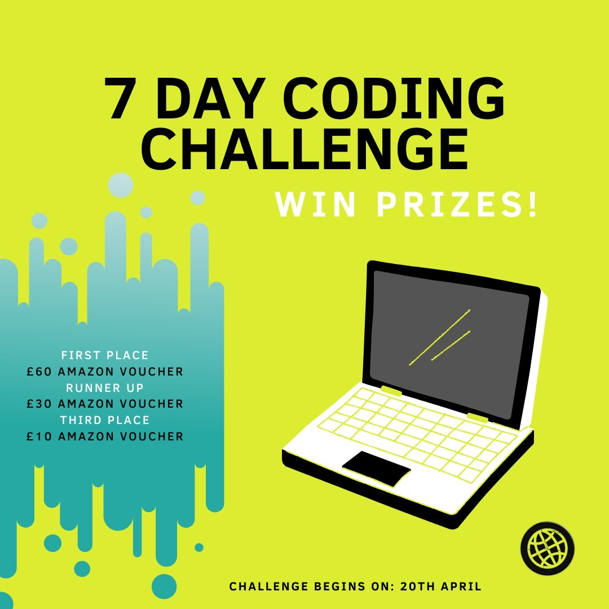
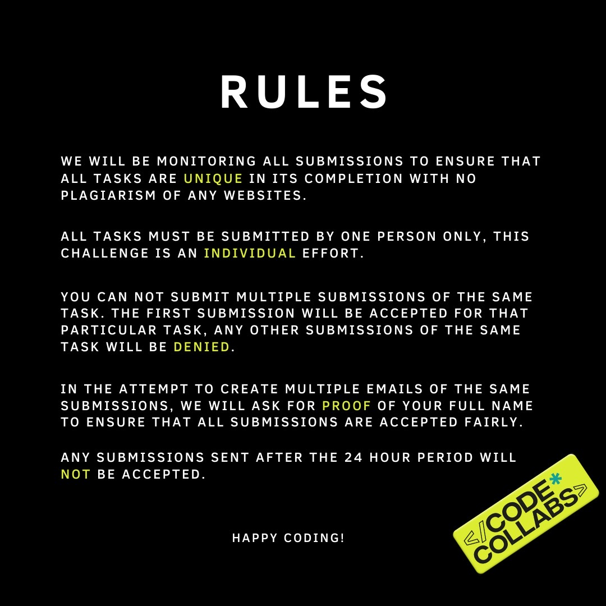
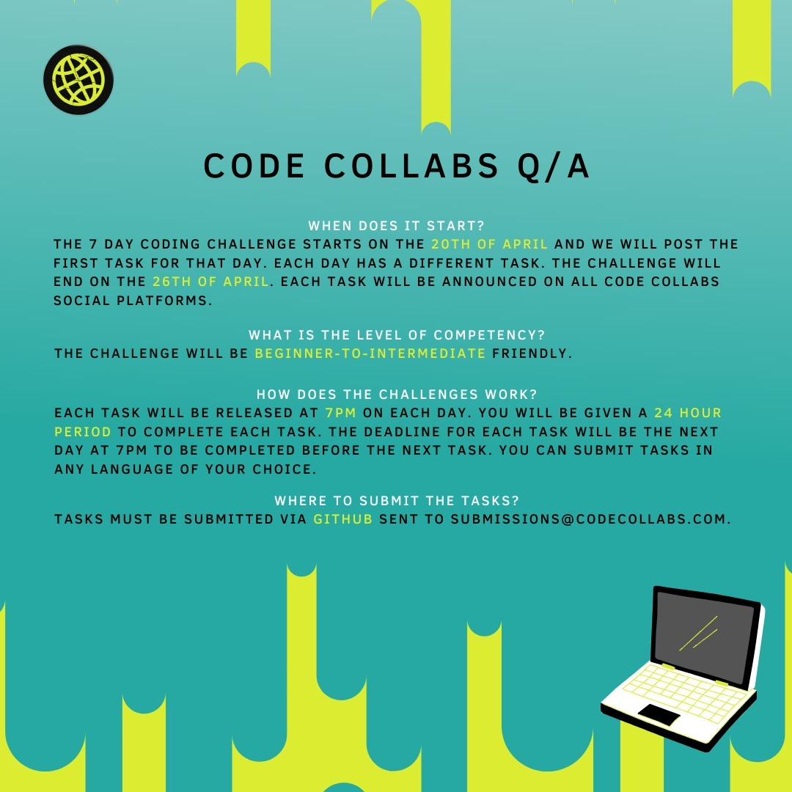

# Code Collabs 7 day Challenge

  

--------------------------------------------------------------------------------

## Overview 

JOIN OUR `WORK FROM HOME` 7 DAY CODING CHALLENGE WIN AMAZON VOUCHERS! `#challenges` `#coding` `#codecollabs` `#winprizes` `#amazonvouchers` `#code`.

## Rules 📖

  

## Q/A 

  

## Submission

[Fork](https://help.github.com/en/github/getting-started-with-github/fork-a-repo) this repo. Select the branch for the corresponding day, add your source file and do a pull request.
